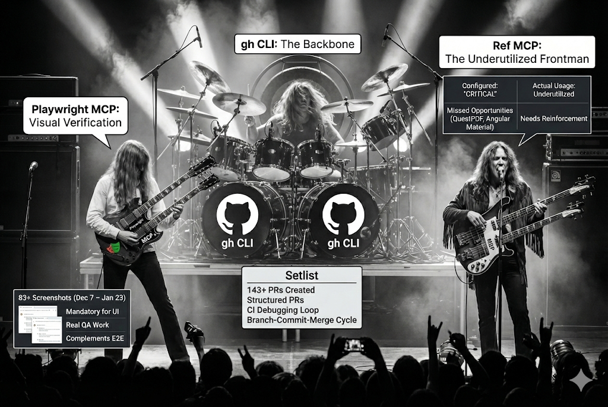

# Code Review

## BMAD

Simply put it is a collection of agents and workflows.  It's AI agnostic.  So it works for Claude-Code, Gemini, Copilot, etc.  The agents that I am most familiar with are Dev, Scrum Master, Analyst and Architect.  It is customizable.  You can give agents 'memories'.


You can also make custom workflows and custom agents.  Though I have not.

## MCPs and Tools


[Tools assessment](./code-review-tools-assessment.md)

## Planning Documents Pattern

1. This is a long process in which you have interviews with various agents. The first step is to [create product brief workflow](../_bmad/bmm/workflows/1-analysis/create-product-brief/workflow.md).  Tracing this workflow we see that we are going to follow a six-step process, the two main artifacts produced by this are the [prd](../_bmad-output/planning-artifacts/prd.md) and [architecture brief](../_bmad-output/planning-artifacts/architecture.md).  These two documents are the lodestar of the project.  Every epic, story and even code review will directly or indirectly reference these documents.  They are the first-class citizens of the AI's context.


## Feature Implementation Pattern

1. Check the [sprint-status.yaml](../_bmad-output/implementation-artifacts/sprint-status.yaml).
2. What story needs an implementation artifact?  This is the artifact that the AI will use as it develops the feature. An [example](../_bmad-output/implementation-artifacts/13-3-property-photo-gallery.md).  This is done by invoking the scrum master agent `/bmad:bmm:agents:sm`.  Here is the [scrum master agent](../.agent/workflows/bmad/bmad-bmm-agents-sm.md). Which leads you to [the real agent](../_bmad/bmm/agents/sm.md).  The agent presents us with a menu of workflows.  And I will always reference the sprint-status.yaml and a story number and it will execute a create [story workflow](../_bmad/bmm/workflows/4-implementation/create-story/workflow.yaml). Which produces a story similar to the above example. When that is done...
3. Clear context.  So important.
4. Invoke the [developer agent](../_bmad/bmm/agents/dev.md).  And then give the agent the story and tell it to develop it with the [develop story workflow](../_bmad/bmm/workflows/4-implementation/dev-story/workflow.yaml).  When the agent is done making code changes I usually instruct the agent to make a new branch, commit changes and create pr in github. This will then trigger [ci/cd checks](https://github.com/daveharmswebdev/property-manager/actions). If it fails I just grab a link to the failed action and tell the AI.  The AI will use [gh cli](https://cli.github.com/) to investigate and it will debug. Sometimes I clear the context before notifying AI with the failed actions, sometimes I don't.  Most checks pass.
5. After successfully passing checks, I clear context call up a dev agent and then run a code review workflow, passing the pr link. ***The review always turns up issues. ALWAYS.*** 
6. I get presented with the issues, and 95% of the time I have it fix all the issues.  It will push the changes to the pr.  Checks pass and I merge the PR.  
7. Clear context and repeat the cycle.


### Big Takeaways

**Clear Context Between Tasks**

> Have to watch context rot.  The less context the better the AI can think.  I rely on the AI to use the planning artifacts and git to gather the necessary information to execute the workflow or task. Sometimes claude-code will auto compact.  And this usually makes me sad.  I take it as a failure that I didn't segment the tasks properly.  I gave the AI an 8 or 13, when I meant to give it a 3 or a 5.

**Code Reviews Always Turns Up Issues**

> Biggest reason I am skeptical of one shot techniques like Ralph Wiggum and GSD.  Because [issues](https://github.com/daveharmswebdev/property-manager/pull/187/changes/589f16e5c55b09b1640d04e5b911f5093759a038) always turn up.

```
Example:

Code review fixes for work order PDF generation (PR #187):
- CRITICAL: Add explicit AccountId filter to query (defense-in-depth)
- Add AsNoTracking() to all three read-only queries (performance)
- Add validator injection and call in controller endpoint (consistency)
- Capture DateTime.UtcNow once to prevent midnight-boundary drift
- Remove redundant DeletedAt filters (global query filter handles it)
```

## Going Forward For Me.

1.  I will be using BMAD for the rest of my rental properties project.
2.  But in the future, whether for another personal project or for a 40AU project.  I would make a custom collection of agents and workflows.  Why?  There's too much in BMAD that I don't use.  And it's not Claude specific.  And for me I would want agents and workflows that take advantage of Claude's unique qualities.  Today it is agent swarm, next week it will be something different and that's why I would want to be able to have direct control over the agents and workflows.  I am grateful for this BMAD learning experience.

## I'm excited about AI, Agentic Coding, Claude, but...

